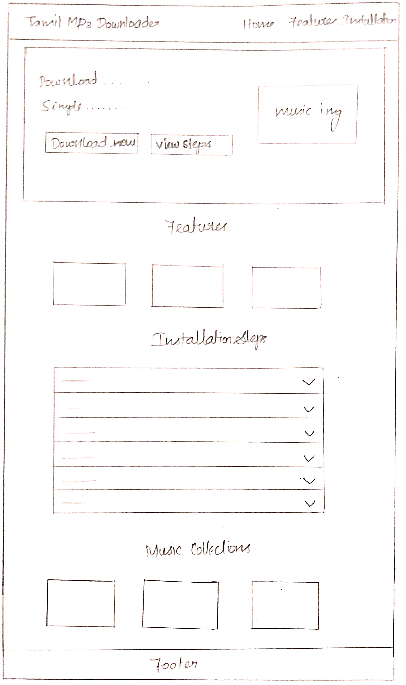
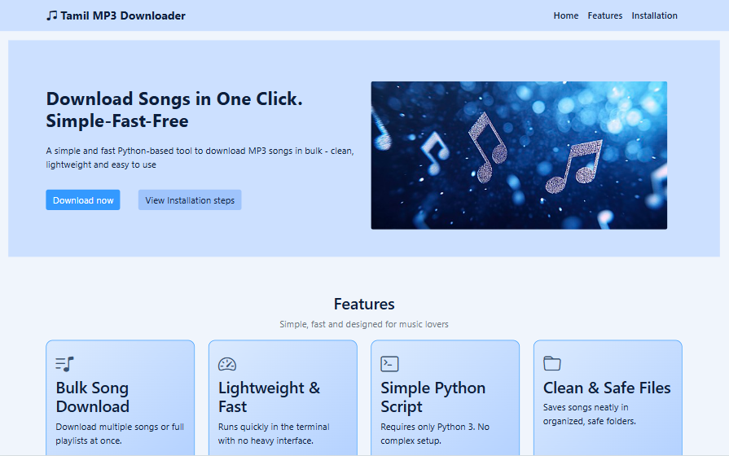
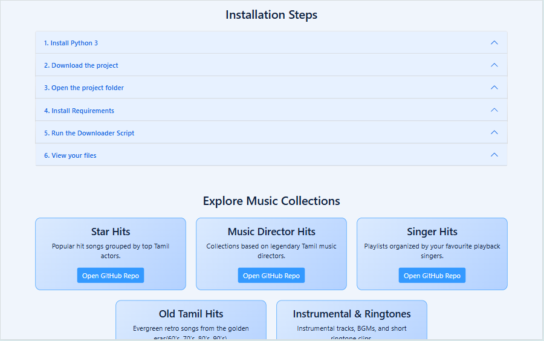
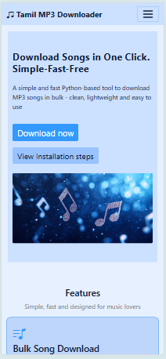
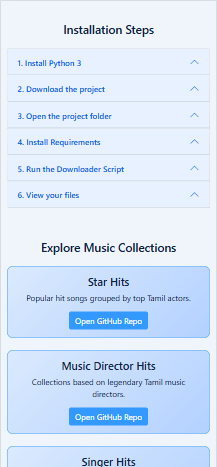

Tamil MP3 Downloader – Landing Page  

**Overview:**  
This project was developed during my Internship at CyberDude Networks Private Limited. This landing page is built using **HTML, CSS, and Bootstrap 5** — without any JavaScript.  
A clean, responsive, Bootstrap-based landing page designed to showcase the features, installation steps, and music collections of the Tamil MP3 Downloader project.

**The UI highlights:**  
- A hero section with CTA buttons  
- Feature cards  
- Installation steps using Accordion  
- A music collection showcase  
- A clean footer  

**Technologies Used:**  
- HTML5  
- Custom CSS  
- Bootstrap 5  
- Bootstrap Icons

**UI Design:**  

**Live Demo:**  
https://ambigaa.github.io/mp3-downloader-landing-page/  

**Screenshots:**  

### Desktop View  
  
  

### Mobile View  

**Author:**
Ambigaa 
Mp3 Downloader Landing page - 2025
